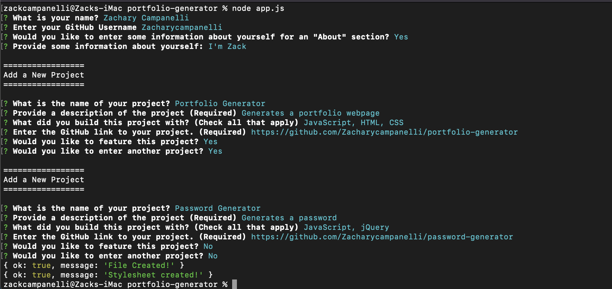

# Portfolio - Generator
  
## Description 

  
A command-line interface application that autogenerates a portfolio website for the user along with their projects

## Table of Contents
* [Installation](#Installation)
* [Usage](#Usage)
* [License](#License)
* [Questions](#Questions)

## Installation
Clone the repository to your local machine. Run the command `npm i` to install the local dependencies required to use this application

  
## Usage
To start the application, run the command `node app.js`. The user is prompted for their name, github profile, and optional extra information about themselves. Then you are looped through adding projects to the website. Each prompt asks about the name of the project, a description, what languages built the project, and if you want to feature a specific project, before asking if there are more projects to add. On the completion of using this app, all of the necessary files for your webpage will appear in the `dist` folder

  

## License
A short and simple permissive license with conditions only requiring preservation of copyright and license notices. Licensed works, modifications, and larger works may be distributed under different terms and without source code.  

  
## Questions
If you have any questions, concerns, or comments, feel free to contact me:
  
-GitHub: [Zacharycampanelli](https://github.com/Zacharycampanelli)  
-Email: [zaccamp@optonline.net](mailto:zaccamp@optonline.net)
